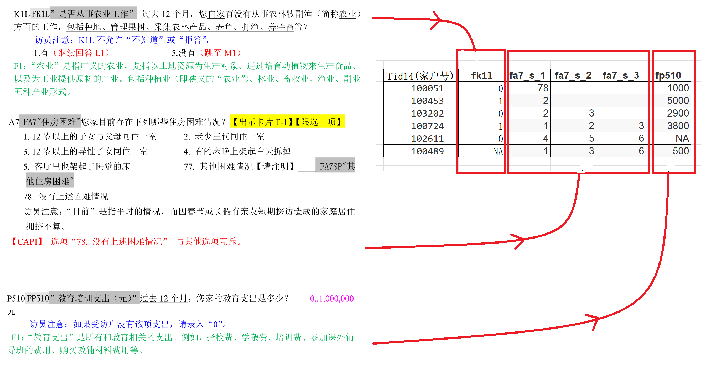

\mainmatter

# 简介 {#intro}

还是简单介绍下北京大学开放数据平台中的中国家庭追踪调查的情况吧


## 调查问卷

调查问卷里有单选题，多选题和填空题，被访问者回答题目后，答案转换到数据集的示意图如下：
```{r echo=FALSE, fig.align='left', out.width='100%'}

```


## 研究方法

1. 文献调研
2. 数据探索
3. 代码储备
