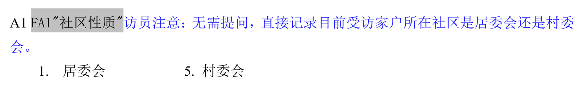
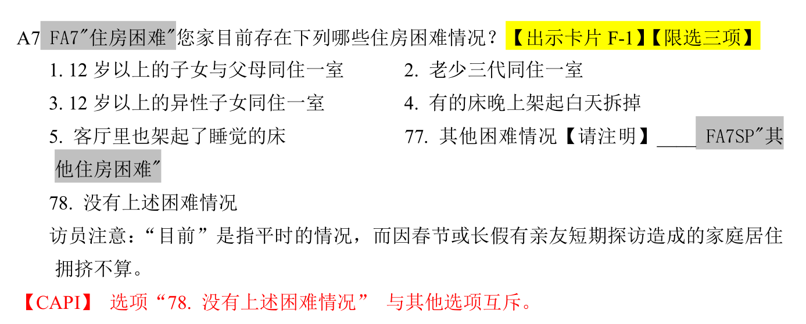
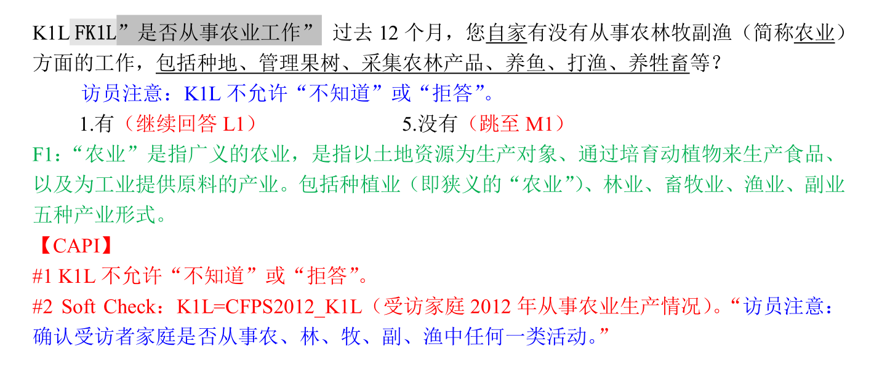
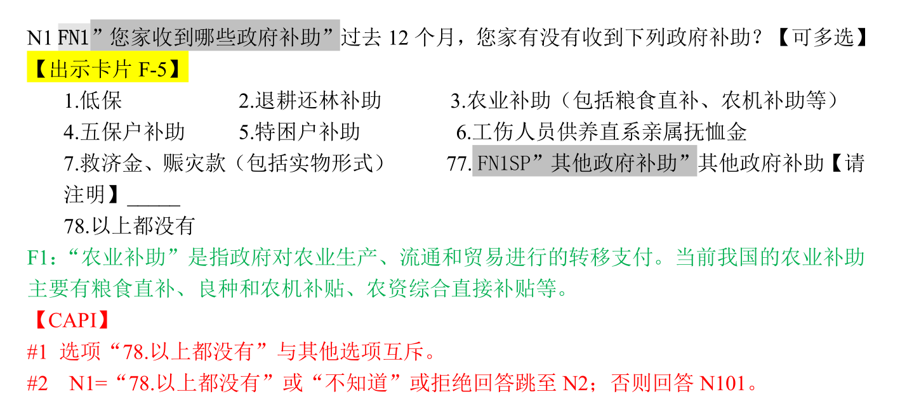
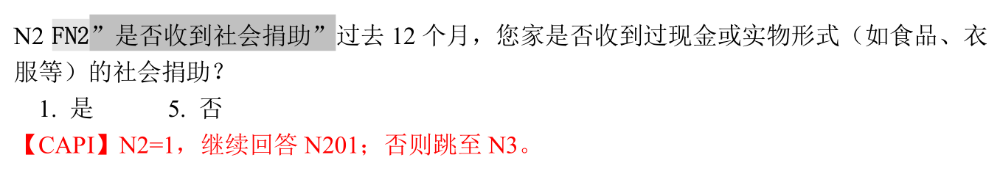
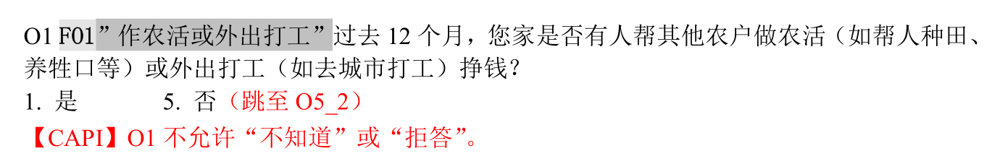
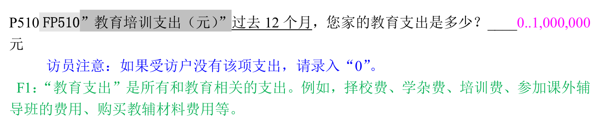
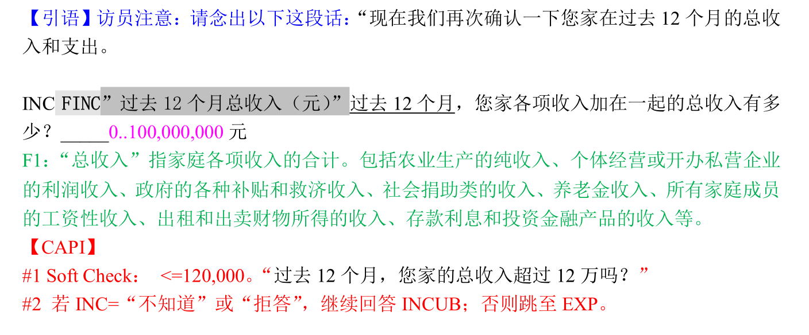

# 农村人力资本投资 {#labor}

劳动力流动、家庭收入与农村人力资本投资

```{r message = FALSE, warning = FALSE}
library(tidyverse)
library(haven)
library(broom)
```


## 数据导入
我们选取了北京大学开放数据平台中的中国家庭追踪调查CFPS^[<http://opendata.pku.edu.cn/>]的2014年数据。
```{r}
cfps2014adult <- read_dta("../data/2014AllData/Cfps2014famecon_170630.dta",
  encoding = "GB2312"
)
```


## 数据探索

```{r}
# colnames(cfps2014adult)
```

## 选取变量
研究劳动力流动、家庭收入与农村人力资本投资的关系^[重复的是这一篇文章]，因此我们选取了...
```{r}
vars_select <- c(
  "fid14", "provcd14", "fa1",
  "fa7_s_1", "fa7_s_2", "fa7_s_3", "fk1l",
  "fn1_s_1", "fn1_s_2", "fn1_s_3", "fn1_s_4",
  "fn101", "fn2", "fn3", "fo1", "fp510",
  "fincome1_per"
)
```


```{r}
cfps2014adult %>% select(vars_select) %>% glimpse()
```


## 获取标签

```{r}
library(purrr)
get_var_label <- function(dta) {
  labels <- map(dta, function(x) attr(x, "label"))
  data_frame(
    name = names(labels),
    label = as.character(labels)
  )
}

cfps2014adult %>% select(vars_select) %>% get_var_label()
```

这里多选题 `fa7_s_2`, `fa7_s_3`, `fn1_s_2`, `fn1_s_3`, `fn1_s_4`有没有用到呢？
还是看看原始的调查问卷比较好。

## 数据统计

```{r}
cfps2014adult %>%
  summarise_all(n_distinct) %>%
  tidyr::gather(vars_name, num_distinct_answers) %>%
  arrange(desc(num_distinct_answers))
```


```{r}
cfps2014adult %>%
  dplyr::select(vars_select) %>%
  #map(~ count(data.frame(x = .x), x))
  purrr::map_if(is.character, ~count(data.frame(x = .x), x) )
```


## 缺失值
```{r}
library(naniar)
cfps2014adult %>%
  select(vars_select) %>%
  miss_var_summary()
```


```{r}
library(visdat)
cfps2014adult %>%
  select(vars_select) %>%
  vis_dat()
```


## 数据规整
我们是这样做数据规整和清洗的：

- 问卷题目
- 变量统计
- 信息提取
- 代码实现

```{r}
tb <- cfps2014adult %>%
      select(vars_select)
```


### `fid14`

```{r}
tb %>% count(fid14)
```

数据清洗: 检查是否有重复的

```{r}
#tb %>% distinct(fid14, .keep_all = TRUE)
tb %>% 
  group_by(fid14) %>% 
  filter(n() > 1)
```


### `provcd14`

```{r}
tb %>% count(provcd14)
```
数据清洗: 创建虚拟变量

```{r, eval = FALSE}
# 虚拟变量
  fastDummies::dummy_cols("provcd14") 
```


### `fa1`


```{r echo=FALSE, fig.align='left', out.width='85%'}

```

```{r}
tb %>% count(fa1)
```

数据清洗: 过滤符合情形的`fa1 == 5`

```{r, eval = FALSE}
filter(fa1 == 5) 
```


### `fa7`
```{r echo=FALSE, fig.align='left', out.width='85%'}

```


变量 `fa7_s_2`, `fa7_s_3`没有用到？
还是看看原始的调查问卷比较好。问卷调查是这样设计的：
这道题是多选题，最多选3项。因此就会出现(1,2,3),(2,4,6), (1,4,5) ...这答案，分别用
`fa7_s_1`, `fa7_s_2`, `fa7_s_3`存放。如果少于三项（缺失的、只选1项或者2项的）就左对齐依次存放，
即从`fa7_s_1`开始存放。

| fa7_s_1 | fa7_s_2 | fa7_s_3 |
|---------|---------|---------|
| 78      |         |         |
| 2       |         |         |
| 2       | 3       |         |
| 1       | 2       | 3       |
| 4       | 5       | 6       |
| 1       | 3       | 6       |

也就是说，我们可以是否有住房困难，只需要通过`fa7_s_1`即可。


```{r}
tb %>% count(fa7_s_1)
```

数据清洗: 

- 删除`fa7_s_1`缺失值行`filter(!is.na(fa7_s_1))`

- 删除`fa7_s_1`包含c(-10, -8, -2, -1)的行 

- 并根据`fa7_s_1`住房困难，新建housing变量

```{r, eval = FALSE}
# 删除缺失值
  filter(!is.na(fa7_s_1)) %>%
  # 住房困难fa7_s
  filter(!fa7_s_1 %in% c(-10, -8, -2, -1)) %>%
  # 新建housing变量
  mutate(housing = if_else(fa7_s_1 %in% c(78) | fa7_s_2 %in% c(78) | fa7_s_3 %in% c(78), 0, 1)) 
```

### `fk1l`
```{r echo=FALSE, fig.align='left', out.width='85%'}

```

```{r}
tb %>% dplyr::count(fk1l)
```

数据清洗: 无


### `fn1`
```{r echo=FALSE, fig.align='left', out.width='85%'}

```

```{r}
tb %>% count(fn1_s_1)
```

`fn1`与`fa7`情况类似。`fn1_s_1`, `fn1_s_2`, `fn1_s_3`, `fn1_s_4`主要用到`fn1_s_1`。
换句话说只有`fn1_s_1`包含了1到7，就说明收到政府补助。

数据清洗: 

- 删除`fn1_s_1`缺失值和 c(-10, -9, -8, -2, -1) 行

```{r, eval = FALSE}
 # 过滤
  filter(!fn1_s_1 %in% c(-10, -9, -8, -2, -1)) %>%
```

### `fn101`
```{r echo=FALSE, fig.align='left', out.width='85%'}

```

```{r}
tb %>% count(fn101)
```


数据清洗: 

- 将-8替换为0，并删除缺失值和c(-1, -2, -9, -10)行，

- 求政府补助总额+1的自然对数

```{r, eval = FALSE}
# 替换
  mutate_at(vars(fn101), funs(replace(., . == -8, 0))) %>%
  # 家庭收到政府补助
  filter(!fn101 %in% c(-1, -2, -9, -10)) %>%
```

### `fn2`
```{r echo=FALSE, fig.align='left', out.width='85%'}

```

```{r}
tb %>% count(fn2)
```

数据清洗: 删除-1

```{r, eval = FALSE}
# 否收到社会捐助
  filter(!fn2 %in% c(-1)) %>%
```


### `fn3`
```{r echo=FALSE, fig.align='left', out.width='85%'}

```

```{r}
tb %>% count(fn3)
```

数据清洗: 删除-1和NA 所在的行

```{r, eval = FALSE}
# 是否有人领取离退休金和养老金
  filter(!fn3 %in% c(-1, NA)) 
```


### `fo1`
```{r echo=FALSE, fig.align='left', out.width='85%'}

```

```{r}
tb %>% count(fo1)
```

数据清洗: 删除缺失值

```{r, eval = FALSE}
# 是否打工
  filter(!is.na(fo1)) %>%
```


### `fp510`
```{r echo=FALSE, fig.align='left', out.width='85%'}

```

```{r}
tb %>% count(fp510)
```

数据清洗: 

- 删除c(-10, -9, -8, -2, NA) 这种答案，

- 并根据是否为0，新建变量Y(=是否人力资本投资)， 

- 并计算教育支出+1的自然对数

```{r, eval = FALSE}
# 过去12月的教育支出
  filter(!fp510 %in% c(-10, -9, -8, -2, NA)) %>%
# 是否进行人力资本投入
  mutate(Y = if_else(fp510 %in% c(0), 0, 1)) %>%
# 教育支出计算其自然对数
  mutate(ln_fp510 = log(fp510 + 1)) %>%
```

### `fincome1_per`

```{r echo=FALSE, fig.align='left', out.width='85%'}

```

```{r}
tb %>% count(fincome1_per)
```

数据清洗: 删除其中缺失值，并求自然对数

```{r, eval = FALSE}
# 删除缺失值
  filter(!is.na(fincome1_per)) %>%
# 家庭人均收入fincome1_per的自然对数
  mutate(ln_fincome1_per = log(fincome1_per)) 
```


## 代码实现

| 变量 | 数据清洗 |
|---------|----------------------------------------------|
|fa1      | 过滤符合情形的`fa1 == 5`|
|fa7_s_1  | 删除缺失值行`filter(!is.na(fa7_s_1))`|
|fa7_s_1  | 删除包含c(-10, -8, -2, -1)的行 +  并根据住房困难多选题，新建housing变量|
|fn1_s_1  | 删除缺失值和 c(-10, -9, -8, -2, -1) 行|
|fn101    | 将-8替换为0，并删除缺失值和c(-1, -2, -9, -10)行， 并求政府补助总额+1的自然对数|
|fn2      | 删除-1|
|fn3      | 删除-1和NA 所在的行|
|fo1      | 删除缺失值|
|fp510    | 删除c(-10, -9, -8, -2, NA) 这种答案，并根据是否为0，新建变量Y(=是否人力资本投资)， 并计算教育支出+1的自然对数|
|fincome1_per  | 删除其中缺失值，并求自然对数|
|provcd14    |创建省份的虚拟变量|

针对数据探索过程中发现的问题，我们一一做相应的数据规整处理。

```{r}
a <- cfps2014adult %>%
  select(vars_select) %>%
  # 过滤符合情形的
  filter(fa1 == 5) %>%
  # 删除缺失值
  filter(!is.na(fa7_s_1)) %>%
  # 住房困难fa7_s
  filter(!fa7_s_1 %in% c(-10, -8, -2, -1)) %>%
  # 新建housing变量
  # mutate(housing = if_else(fa7_s_1 == 78 | fa7_s_2 == 78 | fa7_s_3 == 78, 0, 1)) %>%
  mutate(housing = if_else(fa7_s_1 %in% c(78) | fa7_s_2 %in% c(78) | fa7_s_3 %in% c(78), 0, 1)) %>% #
  # 过滤
  filter(!fn1_s_1 %in% c(-10, -9, -8, -2, -1)) %>%
  # 替换
  mutate_at(vars(fn101), funs(replace(., . == -8, 0))) %>%
  # 家庭收到政府补助
  filter(!fn101 %in% c(-1, -2, -9, -10)) %>%
  # 否收到社会捐助
  filter(!fn2 %in% c(-1)) %>%
  # 是否有人领取离退休金和养老金
  filter(!fn3 %in% c(-1, NA)) %>%
  # 是否打工
  filter(!is.na(fo1)) %>%
  # 过去12月的教育支出
  filter(!fp510 %in% c(-10, -9, -8, -2, NA)) %>%
  # 是否进行人力资本投入
  # mutate(Y = if_else(fp510 == 0, 0, 1)) %>%
  mutate(Y = if_else(fp510 %in% c(0), 0, 1)) %>%
  # 删除缺失值
  filter(!is.na(fincome1_per)) %>%
  # 虚拟变量
  fastDummies::dummy_cols("provcd14") %>%
  # 家庭人均收入fincome1_per的自然对数
  mutate(ln_fincome1_per = log(fincome1_per)) %>%
  # 政府补助总额+1的自然对数
  mutate(ln_fn101 = log(fn101 + 1)) %>%
  # 教育支出计算其自然对数
  mutate(ln_fp510 = log(fp510 + 1)) %>%
  # 是否外出打工与收入对数的交乘项
  mutate(fo1xln_fincome1_per = ln_fincome1_per * fo1) %>%
  # 收入的自然对数的二次项
  mutate(ln_fincome1_perxln_fincome1_per = ln_fincome1_per * ln_fincome1_per)
```
交乘项的意义？

<!---
```{r}
# mutate_at(vars(starts_with("fa7_s_")), funs(replace(., . == 78, 0)) ) %>%
# mutate_at(vars("fp510"), funs(replace(., . == 78, 0)) ) %>%
```
--->


```{r}
a %>% map_df(~ sum(is.na(.)))
```

```{r}
# or
# a %>% summarise_at(1:5, ~sum(is.na(.)))
a %>% summarise_all(~ sum(is.na(.)))
```

```{r}
# library(visdat)
# vis_miss(a)
```

```{r}
library(naniar)
a %>%
  miss_var_summary() %>%
  filter(n_miss > 0)
```


```{r}
df <- a %>% select(
  Y, fo1, fo1xln_fincome1_per, ln_fincome1_per,
  ln_fincome1_perxln_fincome1_per, ln_fn101,
  fn2, fk1l, housing, fn3,
  starts_with("provcd14_")
)

df %>%
  map(~ count(data.frame(x = .x), x))
```


## Probit 模型
Probit 模型

$$ \Pr(Y=1 \mid X) = \Phi(X^T\beta), $$

这里 $\Phi$ 为累积分布函数.


加入模型之前，有两点需要考虑

- 是否需要转换因子类型？

- 是否需要做标准化处理？


```{r message=FALSE, warning=FALSE}
data <- df %>%
  mutate_at(vars(fo1, fn2, fk1l, housing, fn3), as.factor) %>%
  mutate_at(vars(
    fo1xln_fincome1_per, ln_fincome1_per,
    ln_fincome1_perxln_fincome1_per, ln_fn101
  ), funs((. - mean(.)) / sd(.)))
# glimpse(data)
```


```{r message=FALSE, warning=FALSE}
probit_t <- glm(
  formula = Y ~ .,
  family = binomial(link = "probit"), # canonical link function
  data = data
)
```


```{r}
tidy(probit_t)
```


## 边际影响
```{r message=FALSE, warning=FALSE}
library(mfx)
probitmfx(formula = Y ~ ., data = data)
```

或者
```{r message=FALSE, warning=FALSE}
# library(margins)
# m <- margins(probit_t)
# plot(m)
```
