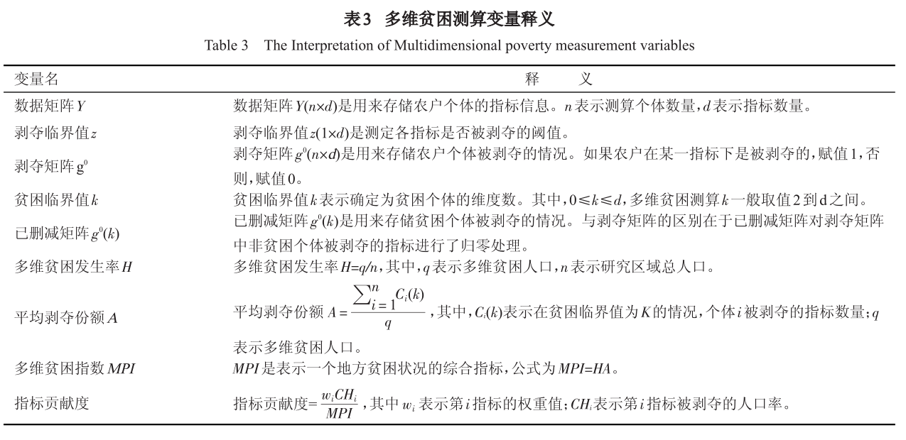

# 社会资本与精准扶贫 {#poverty}

社会资本与精准扶贫

```{r message = FALSE, warning = FALSE}
library(tidyverse)
library(here)
library(fs)
library(haven)
library(broom)
#library(tidylog)
```


## 数据导入
我们选取了北京大学开放数据平台中的中国家庭追踪调查CFPS^[<http://opendata.pku.edu.cn/>]的2014年数据。
```{r}
cfps2014comm <- read_dta("../data/2014AllData/Cfps2014comm_170630.dta",
  encoding = "GB2312"
)

cfps2014famecon <- read_dta("../data/2014AllData/Cfps2014famecon_170630.dta",
  encoding = "GB2312"
)

cfps2014adult <- read_dta("../data/2014AllData/cfps2014adult_170630.dta",
  encoding = "GB2312"
)
```


## 选取变量
筛选**村级数据库**中相关的变量

- use Cfps2014comm_170630.dta
- keep: cid14, ca0, ca2_s_1-ca2_s_15, ca201_a_1-ca201_a_16, cg2, cg201, ck205


筛选**家庭数据库**中相关的变量

- use: Cfps2014famecon_170630.dta
- keep: fid14, cid14, fincome1_per, fa7_s_1-fa7_s_3, fa5, fa3, fa4, fs6_s_1-fs6_s_15, fa9, ft6, ft601, ft602, fml2014num, finance_asset

筛选**成人数据库**中相关的变量

- use: cfps2014adult_170630.dta
- keep: pid, fid14, cid14, provcd14, cfps2012_latest_edu, cfps_birthy, qz208, qp605_s_1-qp605_s_5, qp201, qn12012, qn12014, qn1011-qn1017, qn401_s_1-qn401_s_4, qea0


```{r}
## 获取标签

library(purrr)
get_var_label <- function(dta) {
  labels <- map(dta, function(x) attr(x, "label"))
  data_frame(
    name = names(labels),
    label = as.character(labels)
  )
}
```

村级数据
```{r}
df_community <- cfps2014comm %>%
  dplyr::select(
  cid14, ca0, ca2_s_1:ca2_s_15, ca201_a_1:ca201_a_16, cg2, cg201, ck205
  )

df_community %>% get_var_label()
```

家庭数据
```{r}
df_famecon <- cfps2014famecon %>%
  dplyr::select(
    fid14, cid14, fincome1_per, fa7_s_1:fa7_s_3, fa5, fa3, fa4, 
    fs6_s_1:fs6_s_15, fa9, ft6, ft601, ft602, 
    fml2014num, finance_asset
  )

df_famecon %>% get_var_label()
```


成人数据
```{r}
df_adult <- cfps2014adult %>%
  dplyr::select(
    pid, fid14, cid14, provcd14, cfps2012_latest_edu, 
    cfps_birthy, qz208, qp605_s_1:qp605_s_5, qp201, 
    qn12012, qn12014, qn1011:qn1017, qn401_s_1:qn401_s_4, qea0

  )

df_adult %>% get_var_label()
```


## 三张表合并
```{r}
#df_set <- df_famecon %>%
#  left_join(df_adult, by = "fid14") # %>%
# drop_na()

#list(df_adult, df_famecon, df_community) %>% 
#	reduce(left_join, by = "cid14")
```

```{r}
df_set <- df_adult %>%
  left_join(df_famecon, by = "fid14") %>% 
  #select(fid14, starts_with("cid") )
  left_join(df_community, by = c("cid14.x" = "cid14") )

```

```{r}
df_set %>% colnames()
```


```{r}
df_set %>% arrange(provcd14, cid14, fid14, pid)
```

## 变量解读

依次对变量解读和规整
```{r}
colnames(df_set)
```


```{r}
df_set %>% get_var_label()
```


### pid
```{r echo=FALSE, fig.align='left', out.width='85%'}
# knitr::include_graphics("images/pid.png")
```

```{r}
df_set %>% count(pid)
```
	

	
### fid14		
```{r echo=FALSE, fig.align='left', out.width='85%'}
# knitr::include_graphics("images/fid14.png")
```

```{r}
df_set %>% count(fid14)
```
	


	
### cid14 
```{r echo=FALSE, fig.align='left', out.width='85%'}
# knitr::include_graphics("images/cid14.png")
```

```{r}
df_set %>% count(cid14)
```
	


	
### provcd14	
```{r echo=FALSE, fig.align='left', out.width='85%'}
# knitr::include_graphics("images/provcd14.png")
```

```{r}
df_set %>% count(provcd14)
```
	


	
### cfps2012_latest_edu	
```{r echo=FALSE, fig.align='left', out.width='85%'}
# knitr::include_graphics("images/cfps2012_latest_edu.png")
```

```{r}
df_set %>% count(cfps2012_latest_edu)
```
	


		
### cfps_birthy		
```{r echo=FALSE, fig.align='left', out.width='85%'}
# 
```

```{r}
df_set %>% count(cfps_birthy)
```
	


### qz208	待人接物水平	
```{r echo=FALSE, fig.align='left', out.width='85%'}
# knitr::include_graphics("images/qz208.png")
```

```{r}
df_set %>% count(qz208)
```
	

	
###  qp605_s_1:qp605_s_5		
```{r echo=FALSE, fig.align='left', out.width='85%'}
# knitr::include_graphics("images/qp605_s.png")
```

```{r}
df_set %>% count(qp605_s_1)
```
		
	
		
### qp201	健康状况	
```{r echo=FALSE, fig.align='left', out.width='85%'}
# 
```

```{r}
df_set %>% count(qp201)
```


### qn12012:qn12014


```{r echo=FALSE, fig.align='left', out.width='85%'}

```


```{r}
df_set %>% count(qn12012)
```	


	
### qn1011:qn1017

```{r echo=FALSE, fig.align='left', out.width='85%'}

```


```{r}
df_set %>% count(qn1011)
```

		
			
###  qn401_s_1:qn401_s_4		


```{r echo=FALSE, fig.align='left', out.width='85%'}
# knitr::include_graphics("images/qn401_s.png")
```

```{r}
df_set %>% count(qn401_s_1)
```
		


			
### qea0	当前婚姻状态
```{r echo=FALSE, fig.align='left', out.width='85%'}
# knitr::include_graphics("images/qea0.png")
```

```{r}
df_set %>% count(qea0)
```

		
### fincome1_per	人均家庭纯收入	
```{r echo=FALSE, fig.align='left', out.width='85%'}
# knitr::include_graphics("images/fincome1_per.png")
```

```{r}
df_set %>% count(fincome1_per)
```
	


	
###  fa7_s_1	住房困难
```{r echo=FALSE, fig.align='left', out.width='85%'}
# knitr::include_graphics("images/fa7_s_1.png")
```

```{r}
df_set %>% count(fa7_s_1)
```

		
###  fa5	通电	
```{r echo=FALSE, fig.align='left', out.width='85%'}
# 
```

```{r}
df_set %>% count(fa5)
```


		
###  fa3	做饭用水		
```{r echo=FALSE, fig.align='left', out.width='85%'}

```

```{r}
df_set %>% count(fa3)
```
	


###  fa4	做饭燃料	
```{r echo=FALSE, fig.align='left', out.width='85%'}

```

```{r}
df_set %>% count(fa4)
```	


	
### fs6_s_1:fs6_s_15	您家有下列哪些物品-选择1
```{r echo=FALSE, fig.align='left', out.width='85%'}

```

```{r}
df_set %>% count(fs6_s_1)
```			


### fa9	垃圾倾倒场所	
```{r echo=FALSE, fig.align='left', out.width='85%'}
# 
```

```{r}
df_set %>% count(fa9)
```


				
### ft6	待偿亲友及民间借款			
```{r echo=FALSE, fig.align='left', out.width='85%'}
# 
```

```{r}
df_set %>% count(ft6)
```		

ft601	亲友借款待偿额(元)			
ft602	待偿民间借贷总额（元)


			
### fml2014num	FML2014家庭成员人数

```{r echo=FALSE, fig.align='left', out.width='85%'}
# knitr::include_graphics("images/fml2014num.png")
```

```{r}
df_set %>% count(fml2014num)
```	
	

			
### finance_asset	家庭总金融资产（元）
```{r echo=FALSE, fig.align='left', out.width='85%'}
# knitr::include_graphics("images/finance_asset.png")
```

```{r}
df_set %>% count( finance_asset)
```


					
### ca0	社区性质	
```{r echo=FALSE, fig.align='left', out.width='85%'}
# 
```

```{r}
df_set %>% count(ca0)
```	


			
### ca2_s_1:ca2_s_15	
```{r echo=FALSE, fig.align='left', out.width='85%'}
# knitr::include_graphics("images/ca2_s.png")
```

```{r}
df_set %>% count(ca2_s)
```				
	


		
### ca201_a_1:ca201_a_16	
```{r echo=FALSE, fig.align='left', out.width='85%'}
# knitr::include_graphics("images/ ca201_a_1.png")
```

```{r}
df_set %>% count( ca201_a_1)
```	


		
### cg2	距本县县城距离(里)	
```{r echo=FALSE, fig.align='left', out.width='85%'}
# knitr::include_graphics("images/fid14.png")
```

```{r}
df_set %>% count(fid14)
```	


			
### cg201	到本县县城时间(小时)
```{r echo=FALSE, fig.align='left', out.width='85%'}
# knitr::include_graphics("images/fid14.png")
```

```{r}
df_set %>% count(fid14)
```		


### ck205	转移支付(万元)

```{r echo=FALSE, fig.align='left', out.width='85%'}
# knitr::include_graphics("images/fid14.png")
```

```{r}
df_set %>% count(fid14)
```		


## 多维度贫困测量

```{r echo=FALSE, fig.align='left', out.width='100%'}

```


## 剥夺矩阵

假定有这样一个数据框
```{r}
df <- tribble(
  ~id, ~x, ~y, ~z, ~g,
  #--|--|--|--|--
  "a", 13.1, 14, 4, 1,
  "b", 15.2, 7, 5, 0,
  "c", 12.5, 10, 1, 0,
  "d", 20, 11, 3, 1
)
df
```

设定每个变量的临界值为
```{r}
cutoffs <- list(
  x = 13,
  y = 12,
  z = 3,
  g = 1
)
```

剥夺矩阵
```{r}
get_deprivation_df <- function(df, ..., cutoffs) {
  vars <- rlang::enexprs(...)
  quos <- purrr::map(vars, function(var) {
    rlang::quo(dplyr::if_else(!!var < cutoffs[[rlang::as_name(var)]], 1, 0))
  }) %>%
    purrr::set_names(nm = purrr::map_chr(vars, rlang::as_name))

  df %>%
    dplyr::mutate(!!!quos)
}

g0 <- df %>%
  get_deprivation_df(x, y, z, g, cutoffs = cutoffs)
g0
```


统计每个人被剥夺了多少， 即每一行中有多个变量是1。
```{r}
add_deprivations_counting <- function(df) {
  fun <- function(...) sum(c(...) == 1)
  df %>% mutate(n = pmap_dbl(select_if(., is.numeric), fun))
}

g0_k <- g0 %>% add_deprivations_counting()
g0_k
```
得到了剥夺矩阵，下面进行的是贫困人口识别。

### 识别方法一：统计剥夺变量个数
再给定一个k值，如果每个人剥夺次数小于k值，说明**不贫穷**，那么这个人所在行全部归零。
没被清零的，说明是贫穷的
```{r}
censor_aggregation <- function(df, k) {
  fun <- function(...) sum(c(...) == 1)
  df %>%
    nest(-id, -n) %>%
    mutate(data = if_else(
      n == k, # Censor data of nonpoor
      map(data, function(x) mutate_all(x, funs(replace(., TRUE, 0)))),
      data
    )) %>%
    tidyr::unnest() %>%
    dplyr::select(-n) %>%
    mutate(n = pmap_dbl(select_if(., is.numeric), fun))
}

g0_k1 <- g0_k %>% censor_aggregation(k = 1)
g0_k1
```


根据上面**识别**出来的贫穷人口，计算一些比率
```{r}

Headcount_Ratio <- function(df) {
  d <- nrow(df)
  q <- df %>% summarise(num_nopoor = sum(n != 0)) %>% pull()
  H <- q / d

  return(H)
}

average_deprivation_share <- function(df) {
  d <- nrow(df)
  q <- df %>% summarise(num_nopoor = sum(n != 0)) %>% pull()
  A <- df %>%
    mutate(ck_d = n / d) %>%
    summarise(sum_sk_d = sum(ck_d) / q) %>%
    pull()

  return(A)
}
```


```{r}
g0_k1 %>% Headcount_Ratio()
g0_k1 %>% average_deprivation_share()
```

### 识别方法二：赋予变量权重再统计
这里不再是数每行有多少个1，而是对每个变量赋予权重，求得贫困系数（或者叫贫困概率）。这个过程
也可以用tidyverse的办法
```{r}
weights <- c(
  x = 0.25,
  y = 0.25,
  z = 0.25,
  g = 0.25
)

weighted_sum <- function(.data, weights) {
  ab <- .data %>%
    gather(var, val, x:g) %>%
    mutate(x_weight = val * weights[var]) %>%
    group_by(id) %>%
    summarise(sum_weight = sum(x_weight))

  .data %>% left_join(ab)
}


g0 %>% weighted_sum(weights)
```
或者
```{r}
fun <- function(...) {weighted.mean(..., weights)}
g0 %>% mutate(wt_sum = pmap_dbl(select_if(., is.numeric), lift_vd(fun)))
```

## 变量赋权重再统计(一站式代码)
给出每个变量的**临界值**，得到剥夺矩阵，然后再对每个变量**赋予权重**，求得贫困系数（或者叫贫困概率），根据贫困系数，我们识别贫困人口。事实上，这两步可以合并成一步来完成。

```{r}
cutoffs <- list(
  x = 13,
  y = 12,
  z = 3,
  g = 1
)

weights <- c(
  x = 0.25,
  y = 0.25,
  z = 0.25,
  g = 0.25
)

df_wt <- df %>%
  gather(var, val, x:g) %>%
  mutate(below_cutoff = as.integer(val < cutoffs[var])) %>%
  mutate(weighted_point = below_cutoff * weights[var]) %>%
  group_by(id) %>%
  summarise(weighted_sum = sum(weighted_point))

df %>% left_join(df_wt)
```

或者写出子函数的形式，一劳永逸
```{r message=FALSE, warning=FALSE}

cutoffs <- c(
  x = 13,
  y = 12,
  z = 3,
  g = 1
)

weights <- c(
  x = 0.25,
  y = 0.25,
  z = 0.25,
  g = 0.25
)

get_weightedSum_df <- function(.data, cutoffs, weights) {
  ab <- .data %>%
    gather(var, val, x:g) %>%
    mutate(below_cutoff = as.integer(val < cutoffs[var])) %>%
    mutate(weighted_point = below_cutoff * weights[var]) %>%
    group_by(id) %>%
    summarise(weightSum = sum(weighted_point))

  .data %>% left_join(ab)
}


df %>% get_weightedSum_df(cutoffs, weights)
```
