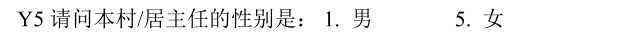
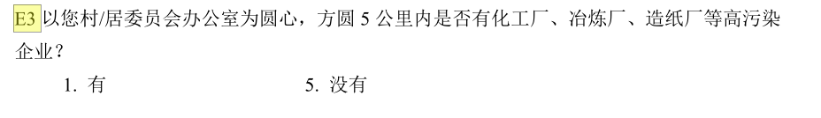

# 村委会行为、村干部特征与农民收入 {#village_leader}

本章内容由张欢、杨敏完成

```{r message=FALSE, warning=FALSE}
library(tidyverse)
library(here)
library(fs)
library(haven)
library(broom)
```


## 数据导入
我们选取了北京大学开放数据平台中的中国家庭追踪调查CFPS^[<http://opendata.pku.edu.cn/>]的2010年数据。
```{r}
cfps2010comm <- read_dta("../data/2010AllData/cfps2010comm_report_nat092014.dta",
  encoding = "GB2312"
)
```
```{r}
cfps2014comm <- read_dta("../data/2014AllData/Cfps2014comm_170630.dta",
  encoding = "GB2312"
)
```

## 数据探索

```{r}
#colnames(cfps2010comm)
```

```{r}
#colnames(cfps2014comm)
```


## 选取变量
研究村委会行为、村干部特征与农民收入的关系^[重复的是这一篇文章]，因此我们选取了...
```{r}
vars_select <- c(
  "cz7", "ch5", "ck301", "ce4", "ce402", "ce401",
  "cd3", "cc1", "cy5", "cy6y", "cy7", "cy8",
  "cb6", "ce3", "cg2", "cg5"
)
```


```{r}
cfps2010comm %>% dplyr::select(vars_select) %>% glimpse()
```


```{r}
tibble(vars_select = vars_select ) %>%
	mutate(year2010 = if_else(vars_select %in% colnames(cfps2010comm), "1", "NA")  ) %>%
	mutate(year2014 = if_else(vars_select %in% colnames(cfps2014comm), "1", "NA")  )
```


## 获取标签

```{r}
library(purrr)
get_var_label <- function(dta) {
  labels <- map(dta, function(x) attr(x, "label"))
  tibble(
    name = names(labels),
    label = as.character(labels)
  )
}

cfps2010comm %>% dplyr::select(vars_select) %>% get_var_label()
```


## 数据规整
还是看看原始的调查问卷比较好


- 问卷题目
- 变量统计
- 信息提取
- 代码实现


```{r}
tb <- cfps2010comm %>%
      dplyr::select(vars_select)
```


### cz7	

```{r echo=FALSE, fig.align='left', out.width='85%'}

```

```{r}
tb %>% count(cz7)
```

数据清洗: 

### ch5		

```{r echo=FALSE, fig.align='left', out.width='85%'}

```

```{r}
tb %>% count(ch5)
```

数据清洗: 

### ck301


```{r echo=FALSE, fig.align='left', out.width='85%'}
knitr::include_graphics('images/ck301.png')
```

```{r}
tb %>% count(ck301)
```

数据清洗: 

### ce4	

```{r echo=FALSE, fig.align='left', out.width='85%'}

```

```{r}
tb %>% count(ce4)
```

数据清洗: 

### ce402

```{r echo=FALSE, fig.align='left', out.width='85%'}

```

```{r}
tb %>% count(ce402)
```

数据清洗: 

### ce401

```{r echo=FALSE, fig.align='left', out.width='85%'}

```

```{r}
tb %>% count(ce401)
```

数据清洗: 	


### cd3		

```{r echo=FALSE, fig.align='left', out.width='85%'}

```

```{r}
tb %>% count(cd3)
```

数据清洗: 

### cc1	

```{r echo=FALSE, fig.align='left', out.width='85%'}

```

```{r}
tb %>% count(cc1)
```

数据清洗: 


### cy5		

```{r echo=FALSE, fig.align='left', out.width='85%'}

```

```{r}
tb %>% count(cy5)
```

数据清洗: 

### cy6y

```{r echo=FALSE, fig.align='left', out.width='85%'}

```

```{r}
tb %>% count(cy6y)
```

数据清洗: 

### cy7		

```{r echo=FALSE, fig.align='left', out.width='85%'}
knitr::include_graphics('images/cy7.png')
```

```{r}
tb %>% count(cy7)
```

数据清洗: 

### cy8	

```{r echo=FALSE, fig.align='left', out.width='85%'}

```

```{r}
tb %>% count(cy8)
```

数据清洗: 

### cb6		

```{r echo=FALSE, fig.align='left', out.width='85%'}

```

```{r}
tb %>% count(cb6)
```

数据清洗: 

### ce3	

```{r echo=FALSE, fig.align='left', out.width='85%'}

```

```{r}
tb %>% count(ce3)
```

数据清洗: 


### cg2	

```{r echo=FALSE, fig.align='left', out.width='85%'}
knitr::include_graphics('images/cg2.png')
```

```{r}
tb %>% count(cg2)
```

数据清洗: 


### cg5	

```{r echo=FALSE, fig.align='left', out.width='85%'}

```

```{r}
tb %>% count(cg5)
```

数据清洗: 
